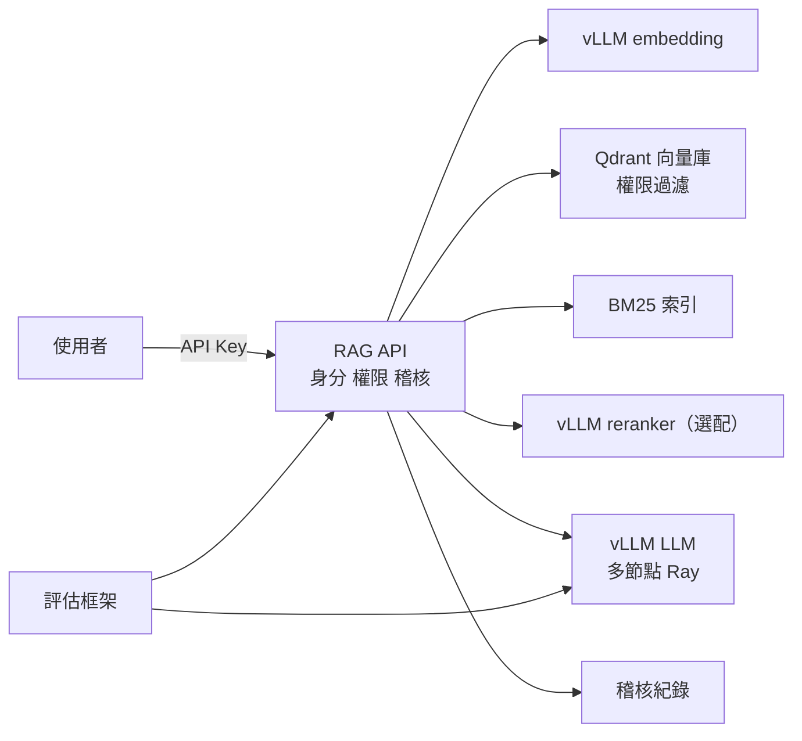

# 地端模型平台與評估集設計文件

> 場景：技術文件與規格書問答（附出處）
> 環境：多台 GPU 叢集｜Linux + Docker｜離線（air-gapped）

## 1. 目標

1. 在內網提供 OpenAI 相容的 LLM 與 embedding 服務，資料不出內網。
2. 提供附出處的文件問答 API，依使用者密等與專案權限，在**檢索階段**就過濾。
3. 全程稽核：使用者、檢索段落、模型輸出都記錄。
4. 用評估集量化比較換模型、改 prompt、改切分方式的效果。

## 2. 架構

| 元件 | 技術 | 位置 |
|---|---|---|
| LLM | vLLM，多節點用 Ray（tensor + pipeline parallel） | GPU 節點 |
| Embedding | vLLM `--task embed` | GPU 節點 |
| Reranker | vLLM `--task score`（選配） | GPU 節點 |
| 向量庫 | Qdrant（payload 過濾） | 服務節點 |
| RAG API | FastAPI | 服務節點 |
| 評估 | Python 腳本 | 任一節點 |

## 3. 權限模型

- `config/users.yaml`：API Key 對應使用者、密等、可存取專案。
- 每個文件段落帶 `level`（數字，越大越高）與 `project`。
- 檢索條件：`level <= 使用者密等` 且 `project ∈ 使用者專案`，向量與 BM25 兩路都套用。
- 回答的密等標示為引用段落中的最高密等。

> MVP 用 API Key 對應身分；正式環境應改接單位的身分驗證系統（LDAP / AD / SSO）。

## 4. 檢索流程

1. 文件切分：依標題與段落切分，保留文件名稱、版本、章節編號。
2. 混合檢索：向量 top-k + BM25 top-k，以 RRF 合併。
3. Rerank（有設定才啟用）。
4. 生成：要求模型只根據段落回答，並用 `[n]` 標註出處；找不到依據時回答「文件中查無依據」。

## 5. 評估集

| 欄位 | 說明 |
|---|---|
| `id` | 題號 |
| `question` | 問題 |
| `user` | 用哪個身分提問（測權限） |
| `expected_sources` | 應該引用的文件與章節 |
| `reference_answer` | 參考答案（可空） |
| `must_include` | 答案必須包含的關鍵字 |
| `expect_no_answer` | 是否應回答「查無依據」 |
| `forbidden_sources` | 不應出現的來源（越權測試） |
| `difficulty` / `tags` | 分類統計用 |

**指標**

| 指標 | 計算 |
|---|---|
| 檢索命中率 Recall@k | 期望來源出現在檢索結果中的比例 |
| 出處正確率 | 回答引用的來源是否屬於期望來源 |
| 關鍵字覆蓋率 | `must_include` 命中比例 |
| LLM 評審分數 | 依 rubric 給 1–5 分（正確性、依據性） |
| 拒答正確率 | 應拒答題是否正確拒答 |
| **越權洩漏數** | 回答或檢索出現 `forbidden_sources`，**目標為 0** |
| 延遲 | P50 / P95 |

**建立原則**：從真實問題收集 50–200 題；涵蓋簡單、跨章節、表格數值、應拒答、越權等類型；LLM 評審要定期由專家抽查校準；線上出錯的案例持續加入。

## 6. 多節點部署

- 每個 GPU 節點跑 Ray（head 或 worker），head 節點啟動 `vllm serve`，設定 `--tensor-parallel-size`（單機 GPU 數）與 `--pipeline-parallel-size`（節點數）。
- 節點間建議使用 InfiniBand 或高速網路。
- 模型越小越好：能單機放下就不要跨節點，可用多個獨立副本搭配負載平衡提高吞吐量。

## 7. 離線作業

- 在可連網的建置機執行 `scripts/save_images.sh` 匯出映像，並準備模型檔與 Python wheel。
- 經掃描與雜湊驗證後，以核准媒體帶入內網，執行 `scripts/load_images.sh`。
- 模型只接受 safetensors 格式，並記錄 SHA256。

## 8. 安全事項

- RAG API 只開放內網，API Key 存放於受控檔案。
- 稽核紀錄只能附加寫入，定期備份。
- 文件內容視為不可信資料，prompt 中明確區隔。
- 用機敏資料微調的模型，權重比照最高密等保管。
