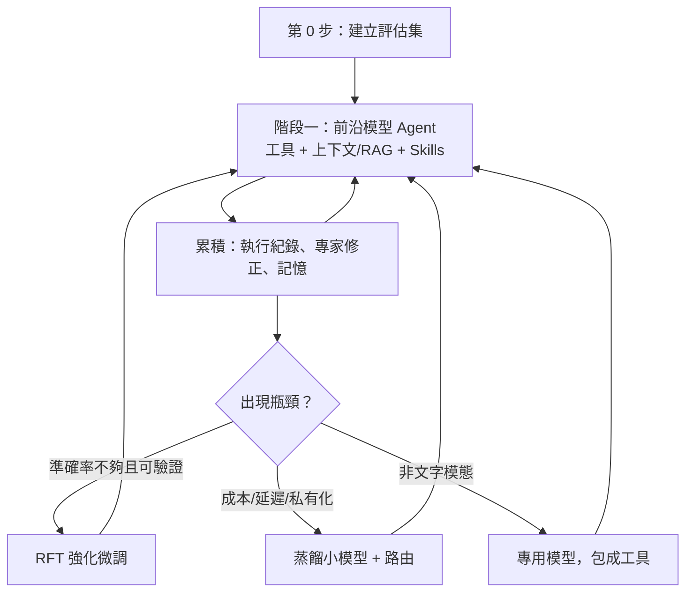

# 專業領域 AI 解決方案評估報告

> 主題：在前沿模型當道的時代，如何最有效地解決特殊專業領域的問題
> 日期：2026-10-06

---

## 1. 摘要

本報告評估四種常見的專業領域 AI 解決方案：

1. 蒐集資料、訓練模型
2. 建立領域知識 RAG
3. 開發 AI Agent（前沿模型 + 長期記憶 + 呼叫現有系統 + ReAct loop）
4. 開發模型蒸餾 Agent，由前沿模型蒸餾出領域模型

**結論**

| 優先順序 | 方案 | 定位 |
|---|---|---|
| 第 0 步 | 建立評估集（Eval） | 所有方案共用的基礎，必須最先做 |
| ⭐ 主軸 | 方法 3：Agent + 前沿模型 | 採「固定流程 + Agent」混合設計 |
| 必要元件 | 方法 2：RAG | 作為 Agent 的工具；知識量小時直接放進上下文即可 |
| 第二階段 | 方法 4：蒸餾 | 有成本、延遲或私有化需求時才做 |
| 依條件選用 | 方法 1：訓練 | 從頭訓練不建議；**強化微調（RFT）適合答案可驗證的領域** |

> [!IMPORTANT]
> 核心原則是：**不要把錢花在和前沿模型本身競爭，要投資在模型以外的資產**，也就是評估集、工具或 API、Skills 和記憶、執行紀錄。這些資產可以跨模型世代沿用，換上更強的模型時，整個系統會跟著變強。

---

## 2. 背景與評估前提

- 前沿模型每 3 到 6 個月就有明顯進步，推理、工具使用和長上下文的能力持續提升。
- 前沿模型的上下文長度已經到幾十萬甚至上百萬 token，搭配 prompt caching，成本也大幅下降。
- 專業領域的瓶頸通常不是「模型不知道某個名詞」，而是：
  - 缺少**最新、私有的資料**
  - 缺少**流程知識**（專家怎麼做事）
  - **無法操作現有系統**
  - **沒有方法驗證結果對不對**

**評估維度**：效果上限、導入成本、上線時間、維護難度、能否跟著模型進步、風險。

---

## 3. 各方案評估

### 3.1 方法 1：蒐集資料、訓練模型

「訓練」包含好幾種做法，評估結果差異很大：

| 訓練方式 | 資料需求 | 成本 | 評估 |
|---|---|---|---|
| 從頭預訓練 | 數千億 token 以上 | 極高 | ❌ 幾乎不值得 |
| 繼續預訓練 | 數十億 token 領域語料 | 高 | ⚠️ 只在領域語言非常特殊時考慮 |
| SFT / LoRA 微調 | 數千到數萬筆 | 低到中 | ✅ 適合固定格式、窄範圍任務 |
| **RFT / RL 強化微調** | 數百到數千題，加上自動評分器 | 中 | ⭐ 答案可驗證的領域效果最好 |
| 偏好學習（DPO） | 專家的成對比較資料 | 中 | ✅ 適合修正判斷傾向和語氣 |

- **優點**：可以地端部署、推論成本低、在窄範圍內表現穩定。
- **缺點**：從頭訓練的模型很快就會落後前沿模型；推理能力很難靠小量資料訓練出來；每次更新都要重新訓練。
- **適用情況**：非文字資料（訊號、影像、分子、時間序列）、完全離線環境、毫秒級延遲需求、答案可以自動驗證。

### 3.2 方法 2：領域知識 RAG

- **優點**：知識可以即時更新、能附上出處、成本低、能做權限控管。
- **缺點**：只解決「查得到」，解決不了「會不會做」；遇到多步推理和實際操作時效果有限。
- **長上下文的影響**：知識量不大時（例如幾百頁以內），直接放進上下文再搭配 prompt caching，常常比 RAG 更準，也更簡單。
- **RAG 仍然必要的情況**：知識量太大、需要權限控管、需要出處以便稽核、知識更新頻繁。
- **常見失敗原因**：文件切分和資料清理沒做好，表格、圖、公式、跨頁內容沒有特別處理。
- **建議做法**：
  - 混合檢索：關鍵字（BM25）加向量，再加 reranker
  - 結構化資料直接用 SQL 或知識圖譜查詢
  - **Agentic RAG**：把 RAG 包成 Agent 的工具，讓 Agent 自己決定要查什麼、要不要再查

### 3.3 方法 3：AI Agent + 前沿模型 ⭐

- **優點**：
  - 直接搭上前沿模型的進步，換模型就升級
  - 可以操作現有系統（ERP、MES、資料庫、模擬器），真正把事情做完
  - ReAct 迴圈加上工具回饋，可以自我修正
  - 上線速度快，從幾週到幾個月
- **缺點與對策**：

| 風險 | 說明 | 對策 |
|---|---|---|
| 成本 | token 用量是單次問答的 10 到 100 倍 | prompt caching、模型分級、限制最多幾步 |
| 延遲 | 每次任務數十秒到數分鐘 | 非同步處理；高頻任務改用蒸餾模型 |
| 不穩定 | 同樣的問題，每次路徑可能不同 | 評估集回歸測試；關鍵步驟用固定流程 |
| 被供應商綁住 | 綁死單一模型 | 中間加一層模型抽象，評估集要能跨模型跑 |
| 資料外洩 | 敏感資料送到外部 API | 資料遮罩、企業合約、敏感任務改用地端模型 |
| 工具誤操作 | 寫入型 API 造成損害 | 讀寫權限分開、寫入要人工核准、先在沙盒跑 |
| Prompt injection | 外部文件藏有惡意指令 | 外部內容視為不可信、限縮工具權限 |

> [!TIP]
> 不要什麼都做成 Agent。**流程固定的就做成 workflow，只有需要判斷和探索的部分才交給 Agent。** 這樣成本和穩定性都會好很多。

**長期記憶設計**

| 類型 | 內容 | 存放方式 |
|---|---|---|
| 語意記憶 | 事實、規則、領域知識 | 知識庫 / RAG |
| 情節記憶 | 過去的案例和處理經過 | 案例庫，用相似度檢索 |
| **程序記憶** | SOP、做事方法、踩過的坑 | **Skills 文件，納入版本控管** |
| 偏好記憶 | 使用者或組織的習慣 | 設定檔 |

**記憶治理原則**：
1. **寫入要有關卡**：Agent 自己總結的經驗先放在候選區，經過專家確認或評估集驗證後，才轉成正式記憶。
2. **要有來源和時間**：每一條記憶都標記出處和日期。
3. **要能刪除和回滾**：發現錯誤時可以撤掉，並追查影響範圍。
4. **定期整理**：合併重複內容，處理互相矛盾的條目。

> [!NOTE]
> 程序記憶（Skills）通常 CP 值最高。把資深專家的做事方法寫成 Skills，效果往往比大量灌文件更明顯。

### 3.4 方法 4：模型蒸餾

- **優點**：推論成本和延遲大幅降低、可以地端部署、在窄範圍內接近前沿模型的表現。
- **缺點**：遇到沒見過的新狀況時能力明顯下降；需要持續重新蒸餾，才能跟上新模型；要注意前沿模型供應商的服務條款是否允許蒸餾。
- **最佳資料來源**：方法 3 留下的**成功執行紀錄**（推理過程、工具呼叫和結果），經過評估集篩選後使用。
- **建議做法**：先用成功紀錄做 SFT，再用評估集的評分器做 RFT。
- **部署架構**：混合路由，小模型處理常見案例，信心不足時交給前沿模型。

---

## 4. 綜合比較

| 維度 | 1. 訓練（從頭） | 1'. RFT 微調 | 2. RAG | 3. Agent | 4. 蒸餾 |
|---|---|---|---|---|---|
| 效果上限 | 中 | 高（窄範圍） | 中高 | **最高** | 高（窄範圍） |
| 導入成本 | 極高 | 中 | 低 | 中 | 中到高 |
| 上線時間 | 長 | 中 | 短 | 短 | 中 |
| 跟著模型進步 | ❌ | ⚠️ 需要重做 | ✅ | ✅✅ | ⚠️ 需要重新蒸餾 |
| 推論成本 | 低 | 低 | 低 | 高 | 低 |
| 能處理新狀況 | 低 | 中 | 中 | **高** | 低到中 |
| 能操作系統 | ❌ | ❌ | ❌ | ✅ | 有限 |
| 私有化部署 | ✅ | ✅ | ✅ | ⚠️ | ✅ |

---

## 5. 評估集：整套方案的核心

沒有評估集，就無法判斷換模型、改 prompt、加記憶、做蒸餾到底有沒有變好。

**建立步驟**：
1. **從真實案例收集** 50 到 200 題，涵蓋簡單題、困難題和邊界情況。
2. **定義評分方式**：
   - 有標準答案的：自動比對
   - 可以驗證的：用程式或模擬器檢查
   - 開放式的：用 LLM 當評審並搭配評分規則（rubric），定期找專家抽查校準
3. **追蹤多個指標**：正確率、成本、延遲、工具呼叫次數、需要人工介入的比例。
4. **持續擴充**：每次線上出錯的案例都加進評估集。

同一份評估集會用在三個地方：
- 方法 3：回歸測試
- 方法 1'：RFT 的獎勵訊號
- 方法 4：篩選蒸餾資料

---

## 6. 決策判斷表

| 情況 | 建議方案 |
|---|---|
| 剛開始、需求還不明確 | 方法 3，知識量小的話直接放進上下文 |
| 知識量大、需要出處或權限控管 | 方法 3 + 2（Agentic RAG） |
| 答案可自動驗證，但前沿模型準確率不夠 | 加上 RFT |
| 呼叫量大、成本吃緊 | 方法 4 蒸餾 + 混合路由 |
| 資料完全不能出內網 | 開源模型地端部署 + RAG + Agent，再用微調或蒸餾補強 |
| 非文字資料 | 方法 1 訓練專用模型，再包成 Agent 的工具 |
| 需要毫秒級回應 | 方法 4，或傳統機器學習模型 |

---

## 7. 建議導入路線

| 階段 | 時程（參考） | 主要工作 | 產出 |
|---|---|---|---|
| 0. 準備 | 2 到 4 週 | 挑選場景、收集真實案例、建立評估集 | 評估集 v1、基準分數 |
| 1. MVP | 1 到 3 個月 | 把現有系統包成工具、建知識層、寫 Skills、做 workflow + Agent | 可用的 Agent、權限與審核機制 |
| 2. 擴展 | 3 到 6 個月 | 長期記憶與治理、擴充工具、專家回饋流程 | 記憶庫、執行紀錄、評估集 v2 |
| 3. 最佳化 | 6 個月以後 | 依瓶頸選擇 RFT、蒸餾或專用模型，建立混合路由 | 降低成本或私有化的部署 |

---

## 8. 成功指標（KPI）

- **品質**：評估集正確率、專家抽查合格率
- **效率**：任務完成時間、人工介入比例
- **成本**：每項任務的平均成本
- **資產累積**：Skills 數量、經驗證的記憶條數、評估集題數
- **風險**：誤操作次數、資安事件數

---

## 9. 結論

1. **第 0 步是建立評估集**，它是所有方案共用的基礎。
2. **方法 3（Agent + 前沿模型）是主軸**，採「固定流程 + Agent」混合設計。
3. **方法 2（RAG）是 Agent 的工具**；知識量小時直接放進上下文。
4. **方法 1 要分開看**：從頭訓練不建議，**RFT 強化微調適合答案可驗證的領域**。
5. **方法 4（蒸餾）是第二階段**，用累積的執行紀錄來做，並搭配混合路由。
6. **長期累積的資產有四種**：評估集、工具或 API、Skills 和記憶、執行紀錄。這些資產可以跨模型世代沿用，是真正的護城河。
