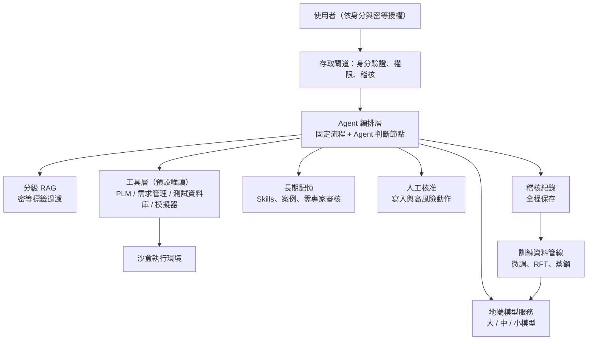

# 國防研發業專業領域 AI 方案評估報告（地端版）

> 適用情境：國防研發單位｜資料不能出內網｜必須使用地端模型
> 日期：2026-10-06
> 本版取代通用版報告中「以雲端前沿模型為主軸」的結論。

---

## 1. 摘要

在**不能使用雲端前沿模型 API** 的前提下，通用版的結論需要調整：

| 項目 | 通用版 | **國防地端版** |
|---|---|---|
| 核心模型 | 雲端前沿模型 | **地端部署的最強開放權重模型** |
| 方法 1（訓練） | 只建議 RFT | **重要性大幅提高**：微調和 RFT 是補足能力差距的主要手段 |
| 方法 2（RAG） | Agent 的工具 | **必要，而且必須有分級權限控管** |
| 方法 3（Agent） | 主軸 | **仍然是主軸**，但工具權限更嚴格、更多採固定流程 |
| 方法 4（蒸餾） | 從雲端前沿模型蒸餾 | **改成地端「大模型蒸餾小模型」**，不能把機敏資料送出去蒸餾 |

**建議組合**

> [!IMPORTANT]
> **評估集 → 地端大模型 + 分級 RAG + 內網 Agent（流程優先）→ 用累積紀錄做微調、RFT 和地端蒸餾**
>
> 在地端環境，模型能力比雲端前沿模型弱一截，所以「方法 1 + 方法 4」從選配變成**持續性的必要工作**；而評估集、工具、Skills、執行紀錄這四項資產，依然是最重要的投資。

---

## 2. 情境限制與影響

| 限制 | 影響 | 對策 |
|---|---|---|
| 資料不能出內網 | 不能用雲端 API，也不能把機敏資料送到外部蒸餾或微調 | 全部在地端完成推論、訓練和評估 |
| 地端模型能力較弱 | 複雜推理、長流程任務的成功率比雲端前沿模型低 | 微調、RFT、固定流程、多做驗證 |
| 實體隔離（air-gap） | 模型、套件、資料更新都很困難 | 建立離線引入與審查流程 |
| 資料有密等分級 | 不同人可以看到的資料不同 | RAG 和記憶都要做分級與「知的需要」（need-to-know）權限控管 |
| 高度可稽核 | 每個結論都要能追溯 | 完整記錄 prompt、檢索來源、工具呼叫和輸出 |
| 供應鏈安全 | 開源模型和套件可能有後門或惡意程式 | 來源審查、雜湊驗證、掃描、只用核准清單內的模型 |
| GPU 資源有限 | 很難跑超大模型 | 依需求分級部署大、中、小模型 |

---

## 3. 各方法重新評估

### 3.1 方法 1：訓練模型（重要性提高）

| 訓練方式 | 評估 | 說明 |
|---|---|---|
| 從頭預訓練 | ❌ | 成本和人力太高，效果也追不上開放權重模型 |
| 繼續預訓練 | ⚠️ 可以考慮 | 如果有大量內部技術文件、規格書、專用術語和縮寫，可以讓模型熟悉領域語言 |
| SFT / LoRA 微調 | ✅ **必要** | 讓模型學會內部的格式、流程、術語和工具呼叫方式 |
| **RFT / RL 強化微調** | ⭐ **高度推薦** | 國防研發有很多**可驗證**的任務，例如計算、模擬、程式碼、規格符合性檢查，很適合當獎勵訊號 |
| 偏好學習（DPO） | ✅ | 用專家的比較判斷，修正模型的判斷傾向 |
| 專用模型（非文字） | ✅ | 雷達、聲納、影像、遙測、振動等訊號資料，應訓練專用模型，再包成 Agent 的工具 |

> [!NOTE]
> 地端微調的主要瓶頸通常是**高品質的訓練資料和專家標註時間**，不是 GPU。所以從第一天就要把專家的修正和 Agent 的執行紀錄存下來。

### 3.2 方法 2：RAG（必要，要做分級）

- **分級檢索**：每份文件和每個段落都要帶密等、單位、專案、知悉範圍等標籤，**在檢索階段就過濾**，不能等到生成階段才擋。
- **權限繼承**：Agent 的檢索權限等於使用者本人的權限，不能比使用者大。
- **文件處理是重點**：國防文件常有大量表格、圖面、公式、掃描檔、規格條文，需要做 OCR、表格解析，以及保留章節和條文編號。
- **混合檢索**：關鍵字（BM25，對料號、規格編號、縮寫特別重要）加向量檢索，再加 reranker。
- **結構化資料**：BOM、測試數據、需求追溯矩陣等，直接用 SQL 或知識圖譜查詢。
- **出處必附**：每個回答都要附文件名稱、版本和條文編號，方便查核。
- **長上下文的限制**：地端模型的有效上下文長度和 GPU 記憶體都有限，所以 RAG 在地端比在雲端更重要。

### 3.3 方法 3：內網 Agent（仍然是主軸）

- **能做的事**：查文件、查資料庫、呼叫模擬程式、跑分析腳本、產生報告草稿、做需求追溯、檢查規格符合性。
- **和通用版的差異**：
  - **固定流程比例更高**：因為地端模型比較弱，長流程交給 Agent 自由發揮的成功率較低，應該把步驟拆細，只在需要判斷的節點用 Agent。
  - **工具權限更嚴**：預設唯讀；寫入、執行、送出類動作一律要人工核准。
  - **在沙盒執行**：程式碼和模擬都在隔離環境中執行。
  - **全程稽核**：每一步的輸入、輸出、檢索來源和工具呼叫都要記錄並保存。
- **長期記憶**：
  - 程序記憶（Skills / SOP）的 CP 值最高，要優先建立。
  - 記憶也要帶密等和知悉範圍標籤，避免跨專案洩漏。
  - 寫入要經過專家審核，避免錯誤經驗擴散。

### 3.4 方法 4：蒸餾（改成地端蒸餾）

- **不能做的事**：把機敏資料或任務內容送到外部前沿模型產生蒸餾資料。
- **可以做的事**：
  1. **地端大模型蒸餾小模型**：在地端用最大的模型（老師）配合 Agent、RAG 和驗證工具產生高品質紀錄，再訓練中小模型（學生），部署在 GPU 較少的單位或邊緣設備上。
  2. **用驗證器篩選**：只保留通過模擬、計算或專家審查的紀錄。
  3. **用非機敏的公開資料在外部產生通用資料**：例如通用工程知識、程式能力的訓練資料。**這需要經過資安和保密單位核准**，而且只能用在不涉及機敏內容的部分。
- **用途**：降低推論成本、部署到邊緣或戰術環境、提高回應速度。

---

## 4. 綜合比較（地端情境）

| 維度 | 從頭訓練 | 微調 / RFT | 分級 RAG | 內網 Agent | 地端蒸餾 |
|---|---|---|---|---|---|
| 必要性 | 低 | **高** | **高** | **高** | 中到高 |
| 效果提升 | 低 | 高 | 中高 | **最高** | 中（主要是降低成本） |
| 導入成本 | 極高 | 中 | 中 | 中 | 中 |
| 對 GPU 的需求 | 極高 | 中到高 | 低 | 中 | 中 |
| 能操作系統 | ❌ | ❌ | ❌ | ✅ | 有限 |
| 可稽核性 | 低 | 低 | **高** | 高（需設計） | 低 |
| 建議時機 | 不建議 | 第一到第二階段 | 第一階段 | 第一階段 | 第二到第三階段 |

---

## 5. 地端模型選型原則

> [!WARNING]
> 開放權重模型的版本更新很快，以下只列原則，實際型號請在導入時依最新評測和合規要求重新評估。

1. **來源合規**：依國防與政府機關的規定，確認模型的開發來源、授權條款，以及是否有限制使用的國家或廠商來源。
2. **授權條款**：確認可以商用或軍用、可以微調、可以再散布（例如部署到其他單位）。
3. **能力評測**：用**自己的評估集**比較，不要只看公開排行榜。重點看中文與英文技術文件理解、工具呼叫、長上下文、程式能力。
4. **分級部署**：

| 等級 | 用途 | 部署位置 |
|---|---|---|
| 大模型 | 複雜推理、Agent 主控、蒸餾老師 | 中央運算中心 |
| 中模型 | 一般問答、RAG、文件處理 | 各研發單位 |
| 小模型 | 分類、抽取、路由、邊緣部署 | 單機或邊緣設備 |
| 專用模型 | 訊號、影像、embedding、reranker | 依需求部署 |

5. **供應鏈安全**：模型檔案要做雜湊驗證、格式安全檢查（例如優先使用 safetensors，避免可執行的 pickle 格式），並在隔離環境中做行為測試，才能引入正式環境。

---

## 6. 參考架構

---

## 7. 安全與合規重點

| 項目 | 要求 |
|---|---|
| 分級控管 | 檢索、記憶、輸出都要依密等和知悉範圍過濾 |
| 輸出管制 | 模型輸出的密等至少等於它引用資料的最高密等 |
| 訓練資料隔離 | 用高密等資料微調的模型，本身也要視同高密等，不能部署到低密等環境 |
| 稽核 | 完整記錄並保存，可以追溯每個結論的來源 |
| 供應鏈 | 模型、套件、容器映像檔都要經過審查才能引入內網 |
| Prompt injection | 文件內容視為不可信；工具權限最小化 |
| 人為判斷 | 涉及設計決策、安全或測試結論的輸出，一律由專家確認，AI 只提供輔助 |
| 法規 | 依資通安全管理法、機關保密規定，以及所屬單位的資安規範辦理 |

> [!CAUTION]
> **用機敏資料訓練出來的模型權重，本身就可能洩漏訓練資料。** 模型檔案的保管、複製和部署，要比照它所用資料的最高密等處理。

---

## 8. 硬體與環境規劃（原則）

- **推論**：依同時使用人數和模型大小估算 GPU 記憶體；使用 vLLM 等高效推論框架，並採用量化（例如 INT8 或 FP8）來降低需求。
- **訓練**：LoRA 微調中型模型的需求相對可行；全參數微調和 RFT 需要較多 GPU，可以集中在運算中心排程使用。
- **離線環境**：建立內部的模型庫、套件庫（PyPI / conda 鏡像）和容器映像庫，並制定定期的離線更新與審查流程。
- **採購**：GPU 可能受出口管制和交期影響，要提早規劃。

---

## 9. 導入路線

| 階段 | 時程（參考） | 主要工作 | 產出 |
|---|---|---|---|
| 0. 準備 | 1 到 2 個月 | 挑選 1 到 2 個高價值、低風險的場景；建立評估集；建置地端環境和離線引入流程；完成資安審查 | 評估集 v1、地端平台、模型基準分數 |
| 1. MVP | 2 到 4 個月 | 分級 RAG、唯讀工具、固定流程 + Agent、稽核機制、Skills 初版 | 可試用的內網 AI 助理 |
| 2. 強化 | 4 到 8 個月 | 用專家修正和執行紀錄做 SFT / LoRA；可驗證任務做 RFT；擴充工具和記憶 | 領域微調模型 v1、評估集 v2 |
| 3. 擴散 | 8 個月以後 | 地端蒸餾小模型、部署到其他單位或邊緣、加入訊號或影像等專用模型 | 分級模型群、跨單位平台 |

**建議優先場景**（風險低、價值高）：
- 技術文件和規格書問答（附條文出處）
- 需求追溯與規格符合性檢查
- 測試報告和技術報告草稿
- 程式碼輔助與審查（內部程式庫）
- 歷史異常與失效案例檢索

**後期場景**（需要更高可靠度）：
- 設計方案的分析與比較
- 模擬參數建議與結果解讀
- 跨系統的自動化工作流程

---

## 10. 主要風險與對策

| 風險 | 對策 |
|---|---|
| 地端模型能力不足 | 拆細流程、強化 RAG、微調和 RFT、加驗證器、保留人工確認 |
| 資料品質差、文件散落 | 先做資料盤點和清理；從單一專案開始 |
| 專家時間不足 | 把專家參與設計成日常審核流程，讓每次修正都成為訓練資料 |
| 跨密等洩漏 | 檢索前過濾、模型依密等分開部署、輸出標註密等 |
| 模型與套件更新困難 | 建立固定週期的離線引入和評估流程 |
| 過度依賴 AI 結論 | 明訂 AI 只能輔助；關鍵結論需要專家簽核 |
| 評估不客觀 | 評估集由領域專家共同建立，並定期更新 |

---

## 11. 成功指標（KPI）

- **品質**：評估集正確率、出處正確率、專家抽查合格率
- **效率**：文件查找時間、報告撰寫時間、需求追溯工時的減少比例
- **採用**：活躍使用者數、重複使用率
- **資產累積**：評估集題數、Skills 數量、經審核的記憶條數、可用的訓練資料筆數
- **安全**：越權存取事件數（目標為 0）、稽核紀錄完整率（目標 100%）

---

## 12. 結論

1. **核心策略不變**：以 Agent 為主軸，投資在模型以外的資產，包括評估集、工具、Skills 和記憶、執行紀錄。
2. **模型改用地端最強的開放權重模型**，並依合規要求選型，分大、中、小三級部署。
3. **方法 1（微調和 RFT）從選配變成必要**，是縮小地端模型和前沿模型差距的主要手段；國防研發有很多可驗證的任務，特別適合 RFT。
4. **方法 2（RAG）必須做分級權限控管**，而且要附出處，滿足稽核需求。
5. **方法 3（Agent）要以固定流程為主**，工具預設唯讀、高風險動作需要人工核准、全程稽核。
6. **方法 4（蒸餾）改成地端大模型蒸餾小模型**，用來擴散到更多單位和邊緣環境。
7. **安全與合規要從一開始就設計進架構**，模型權重要比照訓練資料的最高密等保管。
