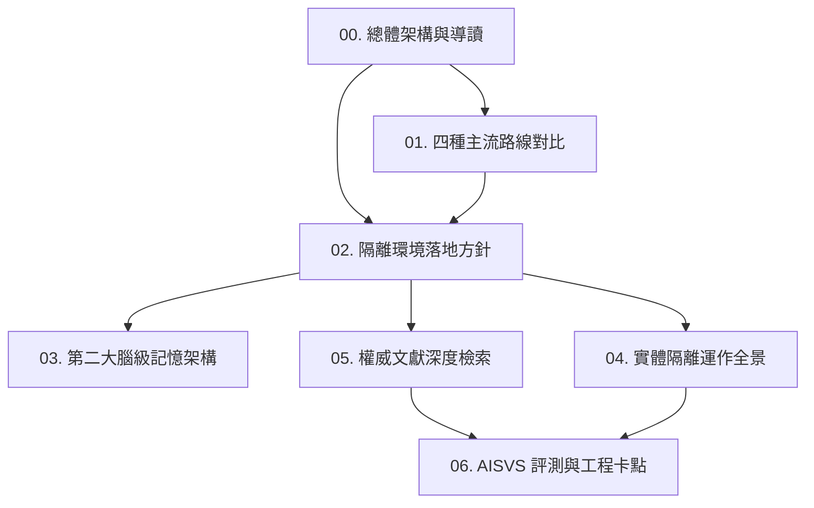

# 專業領域 AI 解決方案：知識庫總體架構與導讀

> **Vault 節點**：`D:\Obsidian\MyVault\Harness\專業領域AI解決方案\`  
> **建立時間**：2026-10-07  
> **核心使命**：在「實體隔離、地端開源 31B 模型、自建 Harness」條件下，建立國防與特殊專業領域 AI 落地之思維記憶與工程知識庫。

---

## 知識圖譜導引 (Table of Contents)

本專題知識庫依照架構邏輯分為 6 大核心模組，各模組間透過雙向鏈結（`[[...]]`）緊密串接，支援非線性思維跳轉與 Obsidian Graph View 視覺化監控：

---

## 各篇核心思維摘要

### 1. [[01_專業領域AI解決方案評估_四種主流技術路線深層對比]]
- **核心論點**：對比「自訓、RAG、Agent 外殼、模型蒸餾」。
- **關鍵結論**：自訓模型上線即開始貶值；組織應以 **AI Agent 為主軸**，將 **RAG 作為工具**，資產應投資在跨模型沿用的「評估集、MCP 工具鏈、Skills 流程與執行紀錄」。

### 2. [[02_實體隔離與地端模型落地方針]]
- **核心論點**：在只有 Google Gemma 31B 稠密模型的算力現實下，如何達成高精準與安全落地。
- **關鍵解法**：算力靠合規開源 31B、外殼借力成熟 Harness（OpenCode + Hermes + DeepAgents）、SOP 代碼化取代微調、零信任 Hooks 護欄防範失誤。

### 3. [[03_第二大腦級記憶架構_Context_Engineering_Git_Obsidian]]
- **核心論點**：告別難以回滾的向量資料庫（Vector DB）黑盒，打造人機共筆的永續第二大腦。
- **架構三大支柱**：
  1. Context Engineering 動態喚醒（防範 Context Rot）。
  2. Git-Backed 記憶版本管控（Markdown 存儲、Trace ID 綁定、PR 人工審核驗收）。
  3. Obsidian 雙向鏈結思維圖譜（`[[Wikilinks]]` 與 Graph View 視覺化）。

### 4. [[04_實體隔離環境運作全景_入庫_智慧_沙箱]]
- **核心論點**：將實體隔離劃分為端到端的三大物理與邏輯邊界。
- **三大維度**：
  1. 物理隔離與資料入庫（單向光閘 Data Diode、靜態消殺、離線手冊庫）。
  2. 地端核心智慧與調度（Gemma 31B、雙軌 Harness、多層 Sub-Agent）。
  3. 國防級沙箱執行與審計（斷網 Docker、AST 靜態語法閘、CAE 仿真適配器、唯讀稽核日誌）。

### 5. [[05_實體隔離環境權威文獻深度檢索_CISA_NIST_MITRE_DARPA]]
- **核心論點**：打破「實體隔離即絕對安全」的迷思（Air-Gap Fallacy）。
- **權威依據**：CISA/NSA Five Eyes 運行時治理、NIST AI RMF 邊界標準、MITRE ATLAS 威脅矩陣、DARPA AIxCC/TRACTOR 專案實證、UC Berkeley 複合 AI 系統（Compound AI Systems）。

### 6. [[06_OWASP_AISVS_1.0_評測矩陣與三大落地工程卡點]]
- **核心論點**：依據全球首部 AI 安全驗證標準（2026 正式版）建立工程驗收清單。
- **三大落地工程卡點**：Pre-Tool 靜態審查、Human-in-the-Loop 簽核閥門、密封沙箱與唯讀審計。
- **7 大評測驗證矩陣**：執行預算熔斷、關鍵動作簽核、工具隔離、動態憑證、反記憶污染、MCP Schema 校驗、不可篡改稽核軌跡。
