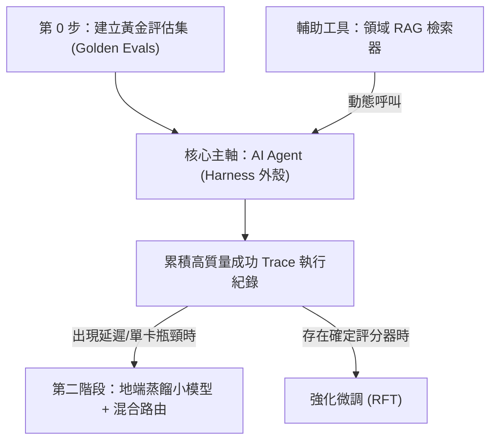

# 專業領域 AI 解決方案評估：四種主流技術路線深層對比

> **來源主題**：在前沿模型當道的時代，專業領域問題之解決方案評估  
> **關聯核心**：[[00_專業領域AI解決方案_總體架構與導讀]] · [[02_實體隔離與地端模型落地方針]]

---

## 1. 議題背景與四種評估路線

面對高門檻專業領域（如航空、機械、熱力、材料、代碼工程），業界常見四種不同層次的技術路線：

1. **從頭自訓模型（Pre-training / SFT）**：自行蒐集大量領域文字語料，從零或基底模型訓練領域專屬權重。
2. **領域知識 RAG（檢索增強生成）**：建立向量與關鍵字混合檢索庫，於對話時動態注入上下文。
3. **AI Agent 外殼（前沿模型 + 長期記憶 + 工具呼叫 + ReAct 循環）**：以開源/前沿模型為大腦，透過狀態機、沙箱工具與記憶機制形成決策閉環。
4. **模型蒸餾（Model Distillation）**：以大模型推理紀錄為原料，蒸餾出輕量化、低延遲的特定任務小模型。

---

## 2. 四種技術路線全面評比

| 評估維度 | 1. 從頭訓練 | 1'. RFT 強化微調 | 2. 領域 RAG | 3. AI Agent 外殼 | 4. 模型蒸餾 |
| :--- | :--- | :--- | :--- | :--- | :--- |
| **效果上限** | 中（受限於自建算力） | 高（限特定窄領域） | 中高（重在事實正確） | ⭐ **最高（具多步推理與修正）** | 高（限收斂任務） |
| **導入成本** | 極高（千萬級算力） | 中等（需驗證器） | 低到中 | 中等（著重工程鷹架） | 中到高 |
| **上線週期** | 長（6-12 個月） | 中（數週） | 短（數天至數週） | 短（數週） | 中（需累積成功軌跡） |
| **隨模型演進增值** | ❌ **上線即開始貶值** | ⚠️ 需重新微調 | ✅ 知識庫跨模型沿用 | ✅✅ **隨開源權重升級即刻變強** | ⚠️ 需定期重新蒸餾 |
| **行動與執行能力** | ❌ 無（僅產出文字） | ❌ 無 | ❌ 無（僅查得事實） | ✅ **能調用 CAE/API 系統** | ◐ 依封裝能力而定 |
| **處理未見新狀況** | 低（泛化差） | 中等 | 中等 | **高（自主探索與自我校驗）** | 低至中等 |

---

## 3. 核心洞察：為什麼「從頭訓練」上線那天就開始貶值？

> [!IMPORTANT]
> **「能力是租來的，權重會貶值，情境才會增值。」**
> 
> * **Bitter Lesson（苦澀的教訓）**：通用算力與大模型架構的進化速度遠快於手工領域特化。自行花費數月微調或預訓練的權重，往往在半年內被全球開源社區的新一代開放模型（如 Gemma 31B）超越。
> * **真正會增值的組織資產**：
>   1. **評估集（Evals）**：定義什麼叫「做對」的黃金 50 題。
>   2. **工具與 API 接口（MCP）**：現有系統的標準可操作介面。
>   3. **Skills 與流程記憶**：資深專家的除錯 SOP 與避坑指南。
>   4. **不可篡改執行紀錄（Trace）**：未來微調與蒸餾的最優原料。

---

## 4. 落地架構堆疊建議

* **結論**：以 **AI Agent 為主軸**，將 **RAG 作為其動態工具**，當專案成熟且任務收斂後才導入**模型蒸餾**。

---

## 5. 相關筆記鏈結
- 核心落地方針：[[02_實體隔離與地端模型落地方針]]
- 記憶治理機制：[[03_第二大腦級記憶架構_Context_Engineering_Git_Obsidian]]
- 威脅防禦矩陣：[[06_OWASP_AISVS_1.0_評測矩陣與三大落地工程卡點]]
